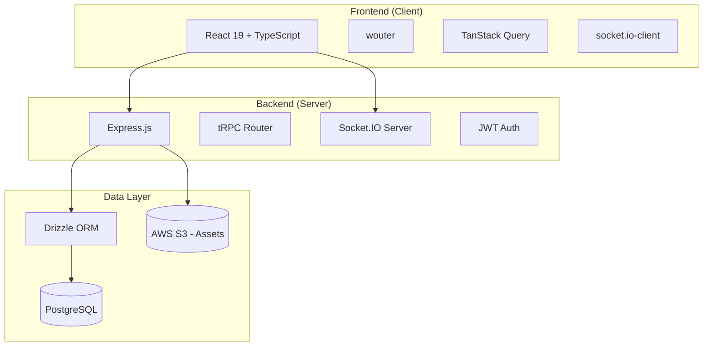
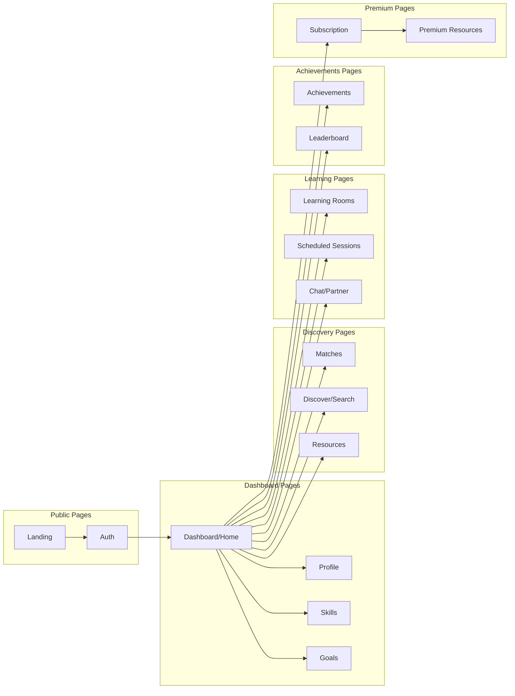
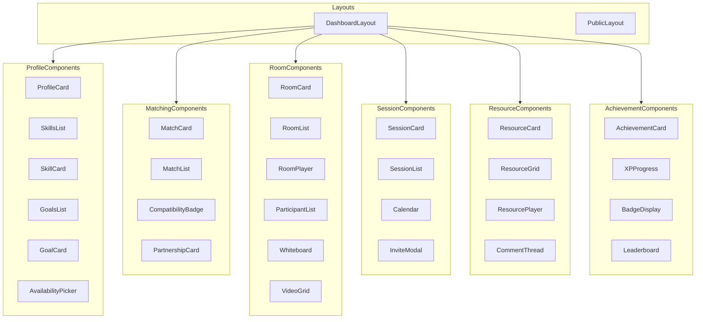
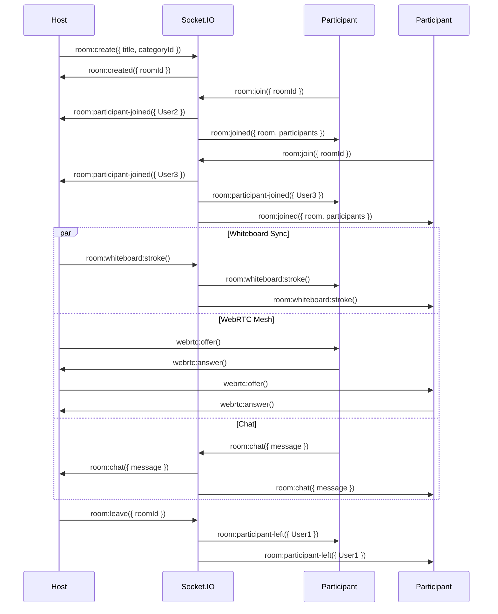

# EchoChat Learning Platform - Technical Specification

## Version: 1.0.0
## Date: 2026-02-13
## Status: Architecture Specification

---

## Table of Contents

1. [Executive Summary](#executive-summary)
2. [Architecture Overview](#architecture-overview)
3. [Database Schema Design](#database-schema-design)
4. [API Architecture](#api-architecture)
5. [Frontend Architecture](#frontend-architecture)
6. [Real-time Features](#real-time-features)
7. [Security & Performance](#security--performance)
8. [Implementation Roadmap](#implementation-roadmap)

---

## 1. Executive Summary

### Vision
Transform EchoChat from a chat application into a global peer-to-peer learning platform where:
- No formal teachers exist - anyone can be both student and teacher
- Learners with skills connect with others who share passions
- Matching algorithm prioritizes: shared interests, complementary skill levels, learning goals, timezone compatibility
- Experience feels like social connection, not academic transaction

### Brand Identity
- Modern, accessible, Gen Z appeal
- "Echo" metaphor: learning spreads like ripples to countless others
- Global connectivity theme

### Core Features (Free)
- Skill Profiling (teach/learn)
- Basic Matching Algorithm
- Collaborative Learning Rooms (2-10 participants)
- Achievement System
- Resource Sharing
- Session Scheduling

### Premium Features (Monetization)
- Advanced matching algorithms
- Verified skill badges
- Virtual classroom tools
- Premium content libraries
- Extended room capacity (up to 50)
- Priority matching

---

## 2. Architecture Overview

### Technology Stack



### Current State Analysis

| Component | Current State | Target State |
|-----------|---------------|--------------|
| Auth | Simple username-based | JWT with roles |
| Database | 8 tables | 20+ tables |
| API | 4 routers | 10+ routers |
| Pages | 5 routes | 15+ routes |
| Real-time | Basic WebSocket | Learning rooms |

---

## 3. Database Schema Design

### 3.1 Skill & Profile Tables

```typescript
// skillCategories - Hierarchical skill categories
skillCategories {
  id: serial PK
  parentId: integer FK (self-referencing)
  name: varchar(100) NOT NULL
  slug: varchar(100) UNIQUE NOT NULL
  description: text
  icon: varchar(50)
  color: varchar(7) // hex color
  type: enum['academic', 'creative', 'athletic', 'professional', 'lifestyle']
  isPremium: boolean DEFAULT false
  sortOrder: integer DEFAULT 0
  createdAt: timestamp
  updatedAt: timestamp
}

// userSkills - Skills users can teach or want to learn
userSkills {
  id: serial PK
  userId: integer FK → users.id
  categoryId: integer FK → skillCategories.id
  type: enum['teach', 'learn'] NOT NULL
  proficiencyLevel: integer CHECK (1-10)
  yearsExperience: integer
  description: text
  isVerified: boolean DEFAULT false
  endorsementCount: integer DEFAULT 0
  createdAt: timestamp
  updatedAt: timestamp
}

// skillEndorsements - Peer endorsements for skills
skillEndorsements {
  id: serial PK
  skillId: integer FK → userSkills.id
  endorserId: integer FK → users.id
  comment: text
  createdAt: timestamp
  UNIQUE(skillId, endorserId)
}

// learningGoals - User's learning objectives
learningGoals {
  id: serial PK
  userId: integer FK → users.id
  title: varchar(200) NOT NULL
  description: text
  targetDate: date
  progress: integer DEFAULT 0 CHECK (0-100)
  isActive: boolean DEFAULT true
  createdAt: timestamp
  updatedAt: timestamp
}

// userAvailability - Timezone and availability for matching
userAvailability {
  id: serial PK
  userId: integer FK → users.id UNIQUE
  timezone: varchar(50) NOT NULL
  preferredTimeStart: time // e.g., "09:00"
  preferredTimeEnd: time // e.g., "21:00"
  daysAvailable: integer[] // [0-6] Sunday-Saturday
  isFlexible: boolean DEFAULT true
  updatedAt: timestamp
}
```

### 3.2 Matching & Partnerships Tables

```typescript
// learningMatches - Generated matches between users
learningMatches {
  id: serial PK
  userId1: integer FK → users.id
  userId2: integer FK → users.id
  compatibilityScore: integer CHECK (0-100)
  sharedInterests: jsonb // array of category IDs
  complementarySkills: jsonb // skill pairs that complement
  timezoneScore: integer CHECK (0-100)
  matchReason: text // explanation of why matched
  status: enum['pending', 'accepted', 'declined', 'expired']
  isPremium: boolean DEFAULT false
  createdAt: timestamp
  expiresAt: timestamp
  UNIQUE(userId1, userId2)
}

// learningPartnerships - Accepted partnerships
learningPartnerships {
  id: serial PK
  userId1: integer FK → users.id
  userId2: integer FK → users.id
  matchId: integer FK → learningMatches.id
  startedAt: timestamp
  lastActiveAt: timestamp
  sessionCount: integer DEFAULT 0
  status: enum['active', 'paused', 'ended']
  endedAt: timestamp
  UNIQUE(userId1, userId2)
}

// partnershipFeedback - Feedback after sessions
partnershipFeedback {
  id: serial PK
  partnershipId: integer FK → learningPartnerships.id
  reviewerId: integer FK → users.id
  rating: integer CHECK (1-5)
  comment: text
  wouldRecommend: boolean
  createdAt: timestamp
}
```

### 3.3 Learning Rooms & Sessions Tables

```typescript
// learningRooms - Collaborative study rooms
learningRooms {
  id: serial PK
  title: varchar(200) NOT NULL
  description: text
  hostId: integer FK → users.id
  categoryId: integer FK → skillCategories.id
  maxParticipants: integer DEFAULT 10
  isPremium: boolean DEFAULT false
  isPublic: boolean DEFAULT true
  status: enum['waiting', 'active', 'ended']
  startedAt: timestamp
  endedAt: timestamp
  createdAt: timestamp
}

// roomParticipants - Users in learning rooms
roomParticipants {
  id: serial PK
  roomId: integer FK → learningRooms.id
  userId: integer FK → users.id
  role: enum['host', 'participant', 'moderator']
  joinedAt: timestamp
  leftAt: timestamp
  isActive: boolean DEFAULT true
  UNIQUE(roomId, userId)
}

// scheduledSessions - Planned learning sessions
scheduledSessions {
  id: serial PK
  title: varchar(200) NOT NULL
  description: text
  hostId: integer FK → users.id
  categoryId: integer FK → skillCategories.id
  scheduledAt: timestamp NOT NULL
  duration: integer NOT NULL // minutes
  maxParticipants: integer DEFAULT 10
  isPremium: boolean DEFAULT false
  meetingLink: varchar(500)
  status: enum['scheduled', 'in_progress', 'completed', 'cancelled']
  createdAt: timestamp
  updatedAt: timestamp
}

// sessionParticipants - Users in scheduled sessions
sessionParticipants {
  id: serial PK
  sessionId: integer FK → scheduledSessions.id
  userId: integer FK → users.id
  status: enum['invited', 'accepted', 'declined', 'attended', 'no_show']
  reminderSent: boolean DEFAULT false
  createdAt: timestamp
}
```

### 3.4 Achievement & Gamification Tables

```typescript
// achievements - Available achievements
achievements {
  id: serial PK
  code: varchar(50) UNIQUE NOT NULL // e.g., 'first_teach', 'streak_7'
  name: varchar(100) NOT NULL
  description: text
  icon: varchar(50)
  category: enum['teaching', 'learning', 'community', 'streak', 'milestone']
  tier: enum['bronze', 'silver', 'gold', 'platinum']
  xpReward: integer DEFAULT 0
  createdAt: timestamp
}

// userAchievements - Earned achievements
userAchievements {
  id: serial PK
  userId: integer FK → users.id
  achievementId: integer FK → achievements.id
  earnedAt: timestamp
  UNIQUE(userId, achievementId)
}

// userXP - Experience points tracking
userXP {
  id: serial PK
  userId: integer FK → users.id UNIQUE
  totalXP: integer DEFAULT 0
  level: integer DEFAULT 1
  teachingXP: integer DEFAULT 0
  learningXP: integer DEFAULT 0
  streakDays: integer DEFAULT 0
  lastActiveDate: date
  updatedAt: timestamp
}

// badges - Premium/monetization badges
badges {
  id: serial PK
  name: varchar(100) NOT NULL
  description: text
  icon: varchar(50)
  type: enum['verified', 'premium', 'mentor', 'top_rated']
  createdAt: timestamp
}

// userBadges - User earned badges
userBadges {
  id: serial PK
  userId: integer FK → users.id
  badgeId: integer FK → badges.id
  earnedAt: timestamp
  expiresAt: timestamp // for time-limited badges
  UNIQUE(userId, badgeId)
}
```

### 3.5 Resource Library Tables

```typescript
// resources - Learning materials
resources {
  id: serial PK
  title: varchar(200) NOT NULL
  description: text
  type: enum['document', 'video', 'link', 'code', 'interactive']
  url: text
  thumbnailUrl: text
  categoryId: integer FK → skillCategories.id
  uploadedBy: integer FK → users.id
  isPremium: boolean DEFAULT false
  isPublic: boolean DEFAULT true
  viewCount: integer DEFAULT 0
  downloadCount: integer DEFAULT 0
  tags: varchar(50)[]
  createdAt: timestamp
  updatedAt: timestamp
}

// resourceRatings - User ratings for resources
resourceRatings {
  id: serial PK
  resourceId: integer FK → resources.id
  userId: integer FK → users.id
  rating: integer CHECK (1-5)
  review: text
  createdAt: timestamp
  UNIQUE(resourceId, userId)
}

// resourceComments - Discussion on resources
resourceComments {
  id: serial PK
  resourceId: integer FK → resources.id
  userId: integer FK → users.id
  parentId: integer FK (self-referencing, nullable)
  content: text NOT NULL
  createdAt: timestamp
  updatedAt: timestamp
}
```

### 3.6 Subscription & Monetization Tables

```typescript
// subscriptionPlans - Available subscription tiers
subscriptionPlans {
  id: serial PK
  name: varchar(50) NOT NULL // e.g., 'free', 'pro', 'enterprise'
  description: text
  priceMonthly: decimal(10,2)
  priceYearly: decimal(10,2)
  features: jsonb
  maxSkills: integer
  maxMatchesPerDay: integer
  maxRooms: integer
  maxParticipantsPerRoom: integer
  hasVerifiedBadges: boolean
  hasAdvancedMatching: boolean
  hasPremiumContent: boolean
  sortOrder: integer DEFAULT 0
  isActive: boolean DEFAULT true
  createdAt: timestamp
}

// userSubscriptions - Active subscriptions
userSubscriptions {
  id: serial PK
  userId: integer FK → users.id
  planId: integer FK → subscriptionPlans.id
  status: enum['active', 'cancelled', 'expired', 'past_due']
  startedAt: timestamp
  expiresAt: timestamp
  autoRenew: boolean DEFAULT true
  createdAt: timestamp
  updatedAt: timestamp
}

// payments - Payment history
payments {
  id: serial PK
  userId: integer FK → users.id
  subscriptionId: integer FK → userSubscriptions.id
  amount: decimal(10,2) NOT NULL
  currency: varchar(3) DEFAULT 'USD'
  paymentMethod: varchar(50)
  transactionId: varchar(100)
  status: enum['pending', 'completed', 'failed', 'refunded']
  createdAt: timestamp
}
```

### 3.7 Extended User Profile Tables

```typescript
// extendedProfiles - Extended user information
extendedProfiles {
  id: serial PK
  userId: integer FK → users.id UNIQUE
  bio: text
  avatarUrl: text
  headline: varchar(200) // short description
  location: varchar(100)
  website: varchar(200)
  linkedIn: varchar(200)
  github: varchar(200)
  languages: varchar(50)[] // ['en', 'es', 'fr']
  interests: integer[] // category IDs
  isOpenToMentoring: boolean DEFAULT false
  isSeekingMentor: boolean DEFAULT false
  preferredSessionType: enum['video', 'audio', 'chat', 'any']
  createdAt: timestamp
  updatedAt: timestamp
}
```

---

## 4. API Architecture

### 4.1 tRPC Router Structure

```typescript
// Main router composition
appRouter = router({
  // Existing routers (preserved)
  auth: router({...}),
  chat: router({...}),
  bottle: router({...}),
  whiteboard: router({...}),
  notifications: router({...}),
  
  // NEW LEARNING PLATFORM ROUTERS
  
  // Skill & Profile Management
  skills: router({
    // Get skill categories
    getCategories: publicProcedure
      .input(z.object({ 
        parentId: z.number().optional(),
        type: z.enum(['academic', 'creative', 'athletic', 'professional', 'lifestyle']).optional()
      }))
      .query(),
    
    // Get user's skills
    getMySkills: protectedProcedure.query(),
    
    // Add skill (teach or learn)
    addSkill: protectedProcedure
      .input(z.object({
        categoryId: z.number(),
        type: z.enum(['teach', 'learn']),
        proficiencyLevel: z.number().min(1).max(10),
        yearsExperience: z.number().optional(),
        description: z.string().optional()
      }))
      .mutation(),
    
    // Update skill
    updateSkill: protectedProcedure
      .input(z.object({
        skillId: z.number(),
        proficiencyLevel: z.number().min(1).max(10).optional(),
        yearsExperience: z.number().optional(),
        description: z.string().optional()
      }))
      .mutation(),
    
    // Remove skill
    removeSkill: protectedProcedure
      .input(z.object({ skillId: z.number() }))
      .mutation(),
    
    // Endorse a user's skill
    endorseSkill: protectedProcedure
      .input(z.object({ skillId: z.number(), comment: z.string().optional() }))
      .mutation(),
    
    // Get user profile with skills (public)
    getUserProfile: publicProcedure
      .input(z.object({ userId: z.number() }))
      .query(),
  }),
  
  // Learning Goals
  goals: router({
    getMyGoals: protectedProcedure.query(),
    createGoal: protectedProcedure
      .input(z.object({
        title: z.string().min(1).max(200),
        description: z.string().optional(),
        targetDate: z.date().optional()
      }))
      .mutation(),
    updateGoal: protectedProcedure
      .input(z.object({
        goalId: z.number(),
        title: z.string().min(1).max(200).optional(),
        description: z.string().optional(),
        targetDate: z.date().optional(),
        progress: z.number().min(0).max(100).optional()
      }))
      .mutation(),
    deleteGoal: protectedProcedure
      .input(z.object({ goalId: z.number() }))
      .mutation(),
  }),
  
  // Matching System
  matching: router({
    // Generate matches for user
    generateMatches: protectedProcedure
      .input(z.object({
        limit: z.number().default(10),
        forceRefresh: z.boolean().default(false)
      }))
      .mutation(),
    
    // Get current matches
    getMatches: protectedProcedure
      .input(z.object({
        status: z.enum(['pending', 'accepted', 'declined']).optional(),
        limit: z.number().default(20),
        offset: z.number().default(0)
      }))
      .query(),
    
    // Accept/decline a match
    respondToMatch: protectedProcedure
      .input(z.object({
        matchId: z.number(),
        action: z.enum(['accept', 'decline'])
      }))
      .mutation(),
    
    // Get partnership details
    getPartnerships: protectedProcedure.query(),
    
    // Give feedback after partnership
    giveFeedback: protectedProcedure
      .input(z.object({
        partnershipId: z.number(),
        rating: z.number().min(1).max(5),
        comment: z.string().optional(),
        wouldRecommend: z.boolean()
      }))
      .mutation(),
  }),
  
  // Learning Rooms
  rooms: router({
    // Create a learning room
    createRoom: protectedProcedure
      .input(z.object({
        title: z.string().min(1).max(200),
        description: z.string().optional(),
        categoryId: z.number(),
        maxParticipants: z.number().min(2).max(50).default(10),
        isPublic: z.boolean().default(true)
      }))
      .mutation(),
    
    // Get room details
    getRoom: protectedProcedure
      .input(z.object({ roomId: z.number() }))
      .query(),
    
    // List public rooms
    getPublicRooms: protectedProcedure
      .input(z.object({
        categoryId: z.number().optional(),
        status: z.enum(['waiting', 'active']).optional(),
        limit: z.number().default(20),
        offset: z.number().default(0)
      }))
      .query(),
    
    // Join a room
    joinRoom: protectedProcedure
      .input(z.object({ roomId: z.number() }))
      .mutation(),
    
    // Leave a room
    leaveRoom: protectedProcedure
      .input(z.object({ roomId: z.number() }))
      .mutation(),
    
    // End room (host only)
    endRoom: protectedProcedure
      .input(z.object({ roomId: z.number() }))
      .mutation(),
    
    // Get my rooms
    getMyRooms: protectedProcedure.query(),
  }),
  
  // Scheduled Sessions
  sessions: router({
    // Create scheduled session
    createSession: protectedProcedure
      .input(z.object({
        title: z.string().min(1).max(200),
        description: z.string().optional(),
        categoryId: z.number(),
        scheduledAt: z.date(),
        duration: z.number().min(15).max(240), // 15 min to 4 hours
        maxParticipants: z.number().min(2).max(50).default(10)
      }))
      .mutation(),
    
    // Get upcoming sessions
    getUpcomingSessions: protectedProcedure
      .input(z.object({
        categoryId: z.number().optional(),
        limit: z.number().default(20)
      }))
      .query(),
    
    // Get my sessions
    getMySessions: protectedProcedure
      .input(z.object({
        status: z.enum(['scheduled', 'in_progress', 'completed']).optional()
      }))
      .query(),
    
    // Invite user to session
    inviteToSession: protectedProcedure
      .input(z.object({
        sessionId: z.number(),
        userId: z.number()
      }))
      .mutation(),
    
    // Respond to session invitation
    respondToSessionInvite: protectedProcedure
      .input(z.object({
        sessionId: z.number(),
        response: z.enum(['accept', 'decline'])
      }))
      .mutation(),
    
    // Cancel session
    cancelSession: protectedProcedure
      .input(z.object({ sessionId: z.number() }))
      .mutation(),
  }),
  
  // Achievements & XP
  achievements: router({
    // Get my achievements
    getMyAchievements: protectedProcedure.query(),
    
    // Get leaderboard
    getLeaderboard: protectedProcedure
      .input(z.object({
        timeframe: z.enum(['all', 'weekly', 'monthly']).default('all'),
        limit: z.number().default(50)
      }))
      .query(),
    
    // Get XP details
    getMyXP: protectedProcedure.query(),
  }),
  
  // Resources
  resources: router({
    // Upload resource
    uploadResource: protectedProcedure
      .input(z.object({
        title: z.string().min(1).max(200),
        description: z.string().optional(),
        type: z.enum(['document', 'video', 'link', 'code', 'interactive']),
        url: z.string(),
        categoryId: z.number(),
        tags: z.array(z.string()).optional(),
        isPremium: z.boolean().default(false)
      }))
      .mutation(),
    
    // Get resources by category
    getResources: publicProcedure
      .input(z.object({
        categoryId: z.number().optional(),
        type: z.enum(['document', 'video', 'link', 'code', 'interactive']).optional(),
        limit: z.number().default(20),
        offset: z.number().default(0)
      }))
      .query(),
    
    // Get resource details
    getResource: publicProcedure
      .input(z.object({ resourceId: z.number() }))
      .query(),
    
    // Rate resource
    rateResource: protectedProcedure
      .input(z.object({
        resourceId: z.number(),
        rating: z.number().min(1).max(5),
        review: z.string().optional()
      }))
      .mutation(),
    
    // Comment on resource
    commentOnResource: protectedProcedure
      .input(z.object({
        resourceId: z.number(),
        content: z.string(),
        parentId: z.number().optional()
      }))
      .mutation(),
  }),
  
  // User Profile
  profile: router({
    // Get my extended profile
    getMyProfile: protectedProcedure.query(),
    
    // Update extended profile
    updateMyProfile: protectedProcedure
      .input(z.object({
        bio: z.string().max(500).optional(),
        headline: z.string().max(200).optional(),
        location: z.string().max(100).optional(),
        website: z.string().max(200).optional(),
        linkedIn: z.string().max(200).optional(),
        github: z.string().max(200).optional(),
        languages: z.array(z.string()).optional(),
        interests: z.array(z.number()).optional(),
        isOpenToMentoring: z.boolean().optional(),
        isSeekingMentor: z.boolean().optional(),
        preferredSessionType: z.enum(['video', 'audio', 'chat', 'any']).optional()
      }))
      .mutation(),
    
    // Update avatar
    updateAvatar: protectedProcedure
      .input(z.object({ avatarUrl: z.string() }))
      .mutation(),
    
    // Update availability
    updateAvailability: protectedProcedure
      .input(z.object({
        timezone: z.string(),
        preferredTimeStart: z.string().optional(),
        preferredTimeEnd: z.string().optional(),
        daysAvailable: z.array(z.number()).optional(),
        isFlexible: z.boolean().optional()
      }))
      .mutation(),
  }),
  
  // Discovery - Find users with specific skills
  discovery: router({
    // Search users by skill
    searchBySkill: publicProcedure
      .input(z.object({
        categoryId: z.number(),
        type: z.enum(['teach', 'learn']),
        limit: z.number().default(20),
        offset: z.number().default(0)
      }))
      .query(),
    
    // Get featured mentors
    getFeaturedMentors: publicProcedure
      .input(z.object({ limit: z.number().default(10) }))
      .query(),
    
    // Get skill suggestions based on interests
    getSkillSuggestions: protectedProcedure.query(),
  }),
  
  // Subscription
  subscription: router({
    // Get current subscription
    getMySubscription: protectedProcedure.query(),
    
    // Get available plans
    getPlans: publicProcedure.query(),
    
    // Create checkout session (Stripe integration)
    createCheckoutSession: protectedProcedure
      .input(z.object({ planId: z.number(), billingCycle: z.enum(['monthly', 'yearly']) }))
      .mutation(),
    
    // Cancel subscription
    cancelSubscription: protectedProcedure
      .input(z.object({ immediately: z.boolean().default(false) }))
      .mutation(),
  }),
});
```

### 4.2 Matching Algorithm Design

```typescript
// Matching algorithm considerations:
// 1. Shared Interests (40% weight)
//    - Overlap in skill categories user wants to learn
//    - Complementary teaching/learning pairs
//
// 2. Skill Complementarity (25% weight)
//    - User A teaches what User B wants to learn
//    - User B teaches what User A wants to learn
//    - Proficiency levels should be complementary (not too far apart)
//
// 3. Learning Goals Alignment (20% weight)
//    - Similar stated learning objectives
//    - Compatible session frequency preferences
//
// 4. Timezone Compatibility (15% weight)
//    - Within 4 hours = 100% score
//    - 4-8 hours = 75% score
//    - 8-12 hours = 50% score
//    - 12+ hours = 25% score
//
// Premium users get:
// - Broader timezone matching
// - More matches per day
// - Priority in queue
```

---

## 5. Frontend Architecture

### 5.1 Page Structure



### 5.2 New Route Definitions

```typescript
// client/src/App.tsx additions

// Learning Platform Routes
const routes = [
  // Existing
  { path: "/", component: Landing },
  { path: "/chat", component: Chat },
  { path: "/whiteboard", component: Whiteboard },
  
  // NEW: Profile & Skills
  { path: "/profile", component: Profile },
  { path: "/profile/:userId", component: PublicProfile },
  { path: "/skills", component: SkillsManagement },
  { path: "/goals", component: LearningGoals },
  
  // NEW: Discovery & Matching
  { path: "/matches", component: Matches },
  { path: "/discover", component: Discover },
  { path: "/partnerships", component: Partnerships },
  
  // NEW: Learning
  { path: "/rooms", component: LearningRooms },
  { path: "/rooms/:roomId", component: LearningRoom },
  { path: "/sessions", component: Sessions },
  { path: "/sessions/create", component: CreateSession },
  
  // NEW: Resources
  { path: "/resources", component: Resources },
  { path: "/resources/:resourceId", component: ResourceDetail },
  
  // NEW: Achievements
  { path: "/achievements", component: Achievements },
  { path: "/leaderboard", component: Leaderboard },
  
  // NEW: Premium
  { path: "/subscription", component: Subscription },
];
```

### 5.3 Component Hierarchy



### 5.4 Key Page Descriptions

| Page | Purpose | Key Components |
|------|---------|----------------|
| Profile | User's extended profile | ProfileCard, SkillsList, GoalsList, BadgeDisplay |
| Skills | Manage teach/learn skills | SkillsList, SkillCard, CategorySelector, ProficiencySlider |
| Goals | Learning objectives | GoalsList, GoalCard, ProgressBar, Calendar |
| Matches | View generated matches | MatchList, MatchCard, CompatibilityBadge, ActionButtons |
| Discover | Search users by skill | SearchFilters, UserCard, SkillTags |
| Learning Rooms | Browse/join rooms | RoomList, RoomCard, ParticipantCount, JoinButton |
| Sessions | Schedule/manage sessions | SessionList, Calendar, InviteModal, SessionCard |
| Resources | Browse learning materials | ResourceGrid, ResourceCard, CategoryFilter, SearchBar |
| Achievements | View earned achievements | AchievementCard, XPProgress, BadgeDisplay |
| Leaderboard | Community rankings | Leaderboard, UserRow, XPProgress |
| Subscription | Manage premium | PlanCard, FeatureList, CheckoutButton |

---

## 6. Real-time Features

### 6.1 WebSocket Event Architecture

```typescript
// Learning Room Events
namespace LearningRoom {
  // Client → Server
  'room:create' → { title, categoryId, maxParticipants }
  'room:join' → { roomId }
  'room:leave' → { roomId }
  'room:chat' → { roomId, message }
  'room: whiteboard:stroke' → { roomId, stroke }
  'room:webrtc:offer' → { roomId, offer }
  'room:webrtc:answer' → { roomId, answer }
  'room:webrtc:ice' → { roomId, candidate }
  
  // Server → Client
  'room:created' → { room }
  'room:joined' → { room, participants }
  'room:participant-joined' → { user }
  'room:participant-left' → { userId }
  'room:chat' → { message }
  'room:ended' → { }
  'room:error' → { error }
}

// Matching Events
namespace Matching {
  // Server → Client
  'match:new' → { match }
  'match:accepted' → { partnership }
  'match:expired' → { matchId }
}

// Session Events
namespace Session {
  // Client → Server
  'session:invite' → { sessionId, userId }
  'session:respond' → { sessionId, response }
  
  // Server → Client
  'session:invited' → { session, inviter }
  'session:starting' → { session }
  'session:reminder' → { session }
  'session:cancelled' → { sessionId }
}

// Presence Events
namespace Presence {
  'presence:update' → { userId, status }
  'presence:users-online' → { users }
}
```

### 6.2 Collaborative Learning Room Architecture



---

## 7. Security & Performance

### 7.1 Authentication Enhancements

```typescript
// Current: Simple username-based auth (preserved for backward compatibility)
// Enhanced: JWT tokens with extended claims

interface JWTPayload {
  userId: number;
  email?: string;
  role: 'user' | 'admin';
  subscription?: {
    planId: number;
    isActive: boolean;
    expiresAt: Date;
  };
  permissions: string[];
  iat: number;
  exp: number;
}

// Permission strings:
// - 'skills:manage' - Can add/edit/remove skills
// - 'rooms:create' - Can create learning rooms
// - 'rooms:host' - Can host premium rooms
// - 'sessions:schedule' - Can schedule sessions
// - 'resources:upload' - Can upload resources
// - 'matching:unlimited' - Unlimited matching (premium)
// - 'verified:badge' - Can have verified badges
```

### 7.2 Rate Limiting Strategy

```typescript
// Rate limits by tier

const rateLimits = {
  free: {
    matchesPerDay: 10,
    roomsPerDay: 5,
    sessionsPerDay: 3,
    resourceUploadsPerDay: 5,
    apiCallsPerMinute: 60
  },
  pro: {
    matchesPerDay: 50,
    roomsPerDay: 20,
    sessionsPerDay: 15,
    resourceUploadsPerDay: 25,
    apiCallsPerMinute: 200
  },
  enterprise: {
    matchesPerDay: -1, // unlimited
    roomsPerDay: -1,
    sessionsPerDay: -1,
    resourceUploadsPerDay: -1,
    apiCallsPerMinute: 1000
  }
};
```

### 7.3 Caching Strategy

```typescript
// Redis cache keys and TTL

const cacheConfig = {
  // Skill categories - cached for 1 hour
  'skill-categories': { ttl: 3600 },
  
  // User profiles - cached for 5 minutes
  'user-profile:*': { ttl: 300 },
  
  // Public rooms - cached for 30 seconds
  'public-rooms:*': { ttl: 30 },
  
  // Resources by category - cached for 5 minutes
  'resources:*': { ttl: 300 },
  
  // Leaderboard - cached for 1 minute
  'leaderboard:*': { ttl: 60 },
  
  // Matches - not cached (real-time)
  
  // Achievements - cached for 10 minutes
  'achievements:*': { ttl: 600 }
};
```

### 7.4 Security Measures

| Area | Implementation |
|------|----------------|
| Input Validation | Zod schemas on all inputs |
| SQL Injection | Drizzle ORM (parameterized queries) |
| XSS | React escaping + Content Security Policy |
| CSRF | Same-site cookies |
| Rate Limiting | In-memory (development) + Redis (production) |
| File Uploads | S3 with signed URLs, max 100MB |
| Private Rooms | Invite-only with unique tokens |
| Premium Content | Server-side validation on access |

---

## 8. Implementation Roadmap

### Phase 1: Foundation (Weeks 1-2)
- [ ] Database schema extensions
- [ ] New tRPC routers (skills, profile, goals)
- [ ] Basic frontend pages (Profile, Skills, Goals)
- [ ] Extended authentication

### Phase 2: Core Matching (Weeks 3-4)
- [ ] Matching algorithm implementation
- [ ] Match generation and storage
- [ ] Match UI (Cards, List, Accept/Decline)
- [ ] Partnership management

### Phase 3: Learning Rooms (Weeks 5-6)
- [ ] Room creation and management
- [ ] Real-time room events
- [ ] WebRTC integration for rooms
- [ ] Room UI components

### Phase 4: Sessions & Resources (Weeks 7-8)
- [ ] Session scheduling
- [ ] Calendar integration
- [ ] Resource upload and storage
- [ ] Resource browsing and rating

### Phase 5: Gamification (Weeks 9-10)
- [ ] Achievement system
- [ ] XP tracking
- [ ] Badges and rewards
- [ ] Leaderboard

### Phase 6: Monetization (Weeks 11-12)
- [ ] Subscription plans
- [ ] Payment integration
- [ ] Premium features gating
- [ ] Checkout flow

### Phase 7: Polish & Launch (Weeks 13-14)
- [ ] UI/UX refinements
- [ ] Performance optimization
- [ ] Testing and bug fixes
- [ ] Documentation

---

## Appendix A: Database Schema Summary

| Table Name | Purpose | Key Fields |
|------------|---------|------------|
| skillCategories | Hierarchical skill organization | parentId, name, type |
| userSkills | User's teach/learn skills | userId, categoryId, type, proficiency |
| skillEndorsements | Peer skill endorsements | skillId, endorserId |
| learningGoals | User learning objectives | userId, title, progress |
| userAvailability | Timezone and schedule | userId, timezone, preferences |
| learningMatches | Generated matches | userId1, userId2, compatibilityScore |
| learningPartnerships | Accepted matches | userId1, userId2, sessionCount |
| learningRooms | Collaborative rooms | hostId, categoryId, status |
| roomParticipants | Room members | roomId, userId, role |
| scheduledSessions | Planned sessions | hostId, scheduledAt, duration |
| achievements | Achievement definitions | code, name, tier, xpReward |
| userAchievements | Earned achievements | userId, achievementId |
| userXP | XP and leveling | userId, totalXP, level |
| resources | Learning materials | title, type, categoryId, url |
| subscriptionPlans | Pricing tiers | name, price, features |
| userSubscriptions | Active subscriptions | userId, planId, status |

---

## Appendix B: API Endpoints Summary

| Router | Endpoints | Description |
|--------|-----------|--------------|
| skills | 7 | Category and skill management |
| goals | 4 | Learning objective CRUD |
| matching | 6 | Match generation and responses |
| rooms | 7 | Learning room management |
| sessions | 6 | Session scheduling |
| achievements | 3 | Achievement and XP |
| resources | 5 | Resource library |
| profile | 4 | Extended profile |
| discovery | 3 | User search |
| subscription | 4 | Premium management |

---

## Appendix C: Frontend Pages Summary

| Page | Route | Components |
|------|-------|------------|
| Profile | /profile | ProfileCard, SkillsList, GoalsList |
| Skills | /skills | SkillCard, CategorySelector |
| Goals | /goals | GoalCard, ProgressBar |
| Matches | /matches | MatchCard, MatchList |
| Discover | /discover | UserCard, SearchFilters |
| Rooms | /rooms | RoomCard, RoomList |
| Room | /rooms/:id | Whiteboard, VideoGrid |
| Sessions | /sessions | Calendar, SessionCard |
| Resources | /resources | ResourceGrid, ResourceCard |
| Achievements | /achievements | AchievementCard, XPProgress |
| Leaderboard | /leaderboard | UserRow |
| Subscription | /subscription | PlanCard |

---

*End of Technical Specification*
