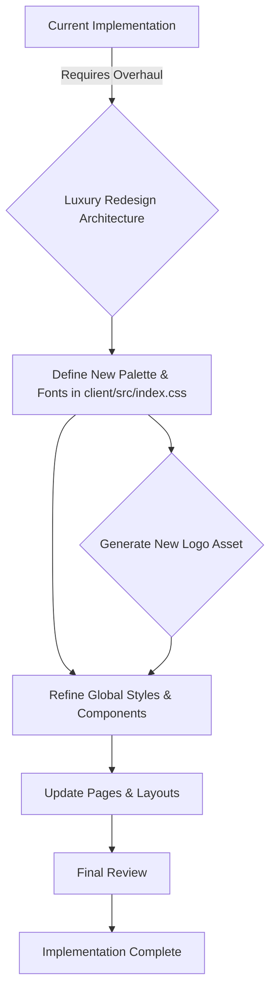

# Redesign Architectural Plan for echo.chat.space Luxury Aesthetic

This plan outlines the necessary steps to transform the current application design into a premium, luxury aesthetic, retaining the existing structural layout.

## Assumed Luxury Direction
To achieve a sophisticated look, we are architecting the following foundational changes:
*   **Color Palette:** Moving from soft neutrals/latte to a richer, deeper foundation.
    *   **Light Mode:** Primary text/dark elements in Rich Espresso (`#1e1a18`), background in warm Off-White (`#fcf9f5`), and accent in Brushed Bronze (`#b5945c`).
    *   **Dark Mode:** Primary elements in Deep Midnight Blue/Charcoal (`#1a1c28`) with Muted Champagne Gold accents.
*   **Typography:** Increasing emphasis on the elegant serif font (`--font-serif`) for all major headings to convey sophistication.
*   **Logo:** A new, abstract logo symbolizing 'echo' using metallic textures will be generated.

## High-Level Workflow

## Todo List Summary
The detailed steps are captured in the task's active To-Do List:
*   [`[ ] Define and implement the new luxury color palette and typography within CSS variables in client/src/index.css.`](./todo.md:1)
*   [`[ ] Design and generate a distinctive, luxury logo for echo.chat.space (asset creation).`](./todo.md:2)
*   [`[ ] Update the ThemeContext in client/src/contexts/ThemeContext.tsx if theme logic needs expansion based on new variable names.`](./todo.md:3)
*   [`[ ] Refactor the global glass/premium styles (e.g., .glass-card, .button-premium) in client/src/index.css for richer visual depth.`](./todo.md:4)
*   [`[ ] Audit and update core UI component styles within client/src/components/ui/ to adopt the new aesthetic (starting with generic components like Card, Button, Input).`](./todo.md:5)
*   [`[ ] Apply the new design language to primary structural components like DashboardLayout.tsx and landing/chat pages (Landing.tsx, Chat.tsx).`](./todo.md:6)
*   [`[ ] Review all pages (Achievements.tsx, Profile.tsx, etc.) to ensure visual consistency with the premium theme.`](./todo.md:7)

Please review this architectural plan and the assumed color direction. Are you pleased with this plan, or would you like to make any changes before we proceed to implementation (starting with Todo #1)?